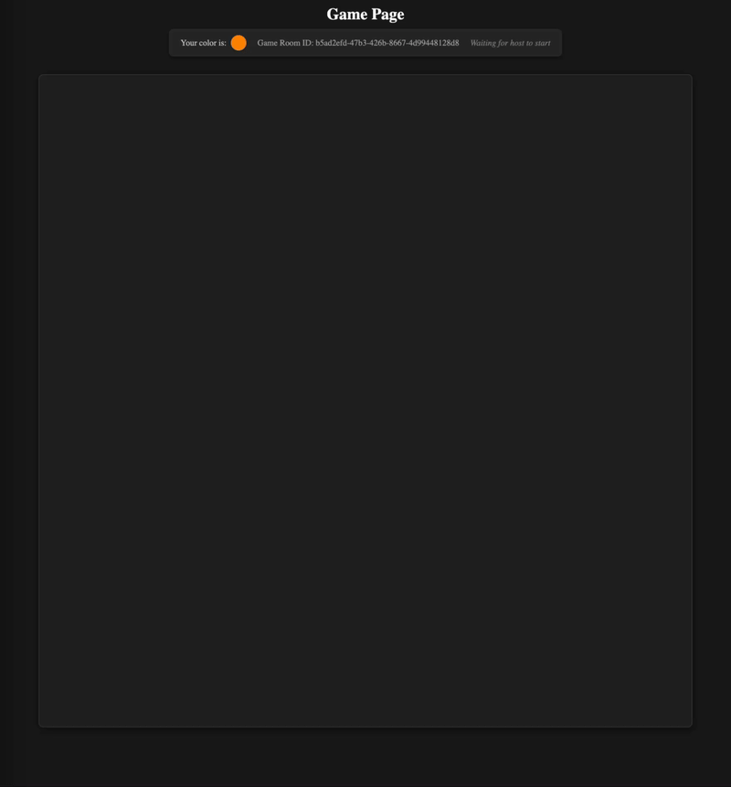

# Snake Attack Server

This is the server for a educational project for a class in Java25. It is a small game where you navigate a grid with other players while painting a line behing you. Survive by avoiding others' and your own trail and the walls. Last to survive wins the game.

## Installation
Open a terminal and run `mvn spring-boot:run` to start the server. Instructions for starting the client can be found [here](https://github.com/Temmuks/grp-3-multiplayer-client/blob/main/README.md#installation).

## Tech used
* Spring Boot
* Websocket
* No Database used

## Models
### GameRoom
Each GameRoom represents an instance of a playable game. It holds information relating to the GameRoom, such as what state it is in (NOT_STARTED / IN_PROGRESS / FINISHED), how many players are allowed in the room, and the players previous positions. etc. Each GameRoom is assigned a random UUID upon creation.

### Player
The Player model holds data related to each player of a single GameRoom. Such as their current position, direction, whether they are alive or not, what color they have been assigned, etc. Each Player is assigned a random UUID upon creation. The playerId is the only 'auth' that is used to confirm that the right player is attempting to do some action.

## Services
### GameRoomService
The service handles methods related to specific game rooms, such as creating, getting, deleting, starting a game room.
### GameService
The service handles methods that relate to game logic, such as applying movements of players, handling collisions, checking winners etc.

## Tests
The tests mainly cover player movements, such as only being able to move when alive, not being able to turn backwards etc.

## Roadmap
* Leaderboard by storing results of past games.
* New move Jump, to be able to escape traps.
* Powerups randomly spawning on the map, giving speed, invincibility etc for a short duration.
* Visual indication of where you spawn and your direction before the game starts.

## Known problems
* A list of PlayerIds is sent with each GameRoomUpdateDTO, which means that a malicious actor can control other players.
* CORS is wide open
* Method broadcastGameRoomList on is a rixed schedule of 500ms. This is somewhat wasteful, and should be rewritten to only be called whenever any data in the list of gameRooms change.

## Team
[**Boren90**](https://github.com/Boren90)
 
 
[**Temmuks**](https://github.com/Temmuks)
 
 
[**williameliasson**](https://github.com/williameliasson)
 
 
[**WWolfburg**](https://github.com/WWolfburg)

## Client repo
[Client repo](https://github.com/Temmuks/grp-3-multiplayer-client)
